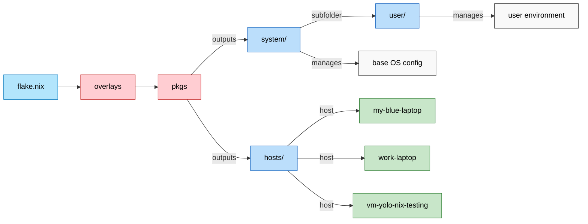

Say Hi to Cognito, my PROJECT:u17553z OS.

Keep in mind the _modules/ directory is just custom made pkgs that I CBA to upload to the Nix Repo to import from there.

📖 How to use this model

On a new device i.e. my-blue-laptop:
Install NixOS normally → you’ll get a hardware-configuration.nix.
Drop that into hosts/<hostname>/.
Update flake.nix so this host is listed in nixosConfigurations.
On an existing device:
Pull everything from your GitHub repo into /etc/nixos.
Run rebuild with the host-specific flag:
sudo nixos-rebuild switch --flake /etc/nixos#<hostname>
e.g. --flake /etc/nixos#my-blue-laptop.
Day to day:
Always rebuild using the host flag for the current machine.

Lack of home-manager or flake-parts is inspired by sioodmy/dotfiles. I am a noob, but his explanations had good minimialistic jazz to it I had to try it! 

# Purpose of this operating system and CUJs

## Cognito's Goal
> As a user, I want my operating systems across all my devices to have frictionless workflow parity, and aim to mimic the functional parts of my brain so that it enhances memory, creativity, and habits — while enforcing guardrails against destructive behaviors — making my computer a digital extension of my cognition.”

## Emergent CUJs from this goal
### CUJ 1 - Brain as Interface
> As a user, I want to navigate Cognito OS through an interactive brain diagram (clickable/keyboard navigable) so that my life functions are organized by mental metaphor rather than menus.
_The sections of this diagram could be comprised of:_
- Basal Ganglia → timekeeping, reminders, habit guardrails.
- Hippocampus → flashcards, knowledge apps, browser-based learning tools.
- Neocortex → archives, projects, PKM.
- Occipital/Parietal lobes (optional expansion) → creative/media tools, spatial tools.

### CUJ 2 - Omnipotent omnibar
> As a user, I want the primary way to access any action, to be via a fuzzy-finding omnibar, so I never need to memorize shortcuts or stupid linux keywords or repetitive multiline scripts. I should be able to use this system even if I had a traumatic brain injury with amnesia. The only pre-requisite being: knowing the English language. UX should be intuitive, like a good video game, that even my boomer parents can navigate in, despite it being terminal based. Natural discoverability > memorization

_Examples:_
- "upload changes to this git repo (performs git pull, add, commit, and push all in one)" 
- “show today’s reminders”
- “launch Steam”
- “open hippocampus → anki”
- Self-regulation can simply be restricting certain omnibar commands during i.e. certain times, since this is the primary "action" UI.

### CUJ 3. In-terminal/ embedded Chromium browser compatibility for PKM and GTD tools and studying.
> As a user, I want the browser integrated into Cognito OS as a native module, so I can access flashcards, PKM tools, and web apps without context-switching.

_Details:_
- Specific brain regions can map directly to web apps which open "inside the terminal", as widgets or popups even.
- Example: Hippocampus → opens AnkiWeb, Memrise, or Obsidian publish site.
- Omnibar can fuzzy-find and launch web apps like local apps.

### CUJ 4 - Habit Guardrails
> As a user, I want Cognito OS to apply digital friction or restrictions to bad habits (like late-night usage), so I build healthier routines.

_Examples:_
- After 23:00 → apps tagged as “dopamine” require justification to open.
- Screen gently dims or locks → nudging to sleep.
- Calendar integration enforces downtime.
- Outcome: OS becomes a partner in self-discipline.

### CUJ 5 - Gaming & Creativity Compatibility
> As a user, I want to run all Steam Proton games and open-source creative software seamlessly, so Cognito OS supports both work and play.

_Examples:_
- “Occipital Lobe → Blender, Krita, Kdenlive.”
- “Launch Elden Ring (Proton)” from omnibar.
- Outcome: No compromise between productivity and play.

### CUJ 6 - Reproducible Mind across machines
> As a user, I want to be able to declaratively rebuild my Cognito OS environment (configs, brain diagram, apps) on new hardware, so my digital mind is portable and stable.

_Examples:_
- nixos-rebuild switch --flake . → restores entire environment.
- Git-based life config = versioned brain.
- Outcome: Cognition is reproducible.

# Development timeline (in-order)
- Now following this series of guides: https://youtube.com/playlist?list=PL_WcXIXdDWWpuypAEKzZF2b5PijTluxRG&si=i4WdNmapB2amEeyy
- [x] ~~Start off not with NixOS, but something purely in the terminal dotfiles or whatever (_i think this is called the nix Home Manager_). ie. get something working on my current Arch System that would also work on my Ubuntu laptop.~~
- [x] Experiment on a VM using full on NixOS
- [ ] Scrap all other distros and go with the full NixOS if i.e. gaming compatibility in Steam is fine; otherwise I can stick with stable distros which fix compatibilities like that for me, a layer above my main terminal-desktop-env.
- [ ] Rice the shit.

# Principles for my OS
https://www.youtube.com/watch?v=9OMDnZWXjn4&pp=0gcJCf8Ao7VqN5tD
https://youtu.be/YHm7e3f87iY
- **No memorization needed**, fuzzy-finding and icon/ hints/ LLM / good intuitive UX, like a well made game. Should be more intuitive than Windows for boomers, or me if I had amnesia and needed to remember who I was - me as a shell of a man should still be able to use my LifeOS, and maybe through spaced-repetition healing and automation, I would pseudo-comeback from the dead and regenerate myself from my digital systems.  _Maybe the minimal requirement is that the user understands English._
- Minimialist.
- Open-source stuff.
- Automated widgets e.g. RemNote / SuperMemo/ TickTick data all combined into a central, always visible "desktop background" terminal, with a GUI (in the terminal), like the maccel terminal.
- Modules of my OS reflect how my own human brain abstracts concepts e.g. Basal Ganglia -> Calendar and TickTick integrations, Hippocampus -> RemNote spaced repetition queues, Neocortex -> Long-term NAS storages.
  - As a result, maybe my home screen can be a graphical diagram of a brain, and I click on whatever section of the digital brain I want to access to get there.
- Network based bi-linking - imitate the brain and read more about interesting concepts like supermemo.guru
  
# Installation guide for a TDE ontop of the current, non-NixOS distro

**Step 1:** Install NixOS on the device - no desktop environment needed.

**Step 2:** Go to `/etc/nixos/` and replace all files there with this repo (containing Nix configs), (ie., ~/nix-config) where `flake.nix` and home.nix is, and apply the configuration using a terminal in that directory and running the command `home-manager switch --flake`. Home-manager is defined inline from our config smartly by the command without needing its own initial install. Or nix run --extra-experimental-features "nix-command flakes" home-manager/release-23.11 -- switch --flake .#cognito
