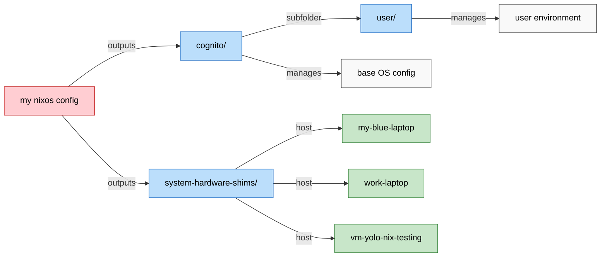

# WARNING THE CURRENT README IS A JARBLE OF AI SLOP AND RANDOM IDEAS I HAVE... STAY TUNED ONCE I GET PAST THE EXPERIMENTATION PERIOD FOR NIXOS

HOW THE FUCK DO I ORGANISE NIX PROJECTS FUCK IT WE INVENT IS AS WE GO. HOME MANAGER? NAH. I'D HASKELL!
Say Hi to Cognito, my PROJECT:u17553z OS.
sudo nixos-generate-config
to create the hardware config in case the nixos didnt auto gen it for your machine in /etc/nixos

Great question — this goes right to the heart of the flakes vs legacy config.nix model 👌.

🔑 The key idea:

With flakes, /etc/nixos no longer has to be your source of truth.

Your repo can live anywhere (e.g. $HOME/cognito), because you explicitly tell Nix to build from it with:


Keep in mind the _modules/ directory is just custom made pkgs that I CBA to upload to the Nix Repo to import from there.

📖 How to use this model

On a new device i.e. my-blue-laptop:
Install NixOS normally → you’ll get a hardware-configuration.nix.
Drop that into system-hardware-shims/<hostname>/.
Update flake.nix so this host is listed in nixosConfigurations.
On an existing device:
Pull everything from your GitHub repo into /etc/nixos.
Run rebuild with the host-specific flag:
sudo nixos-rebuild switch --flake /etc/nixos#<hostname>
e.g. --flake /etc/nixos#my-blue-laptop.
Day to day:
Always rebuild using the host flag for the current machine.

Minimalist approach inspired by sioodmy/dotfiles. I am a noob, but his explanations had good minimalistic jazz to it I had to try it! 

# Purpose of this operating system and CUJs

## Cognito's Goal
> As a user, I want my operating systems across all my devices to have frictionless workflow parity, and aim to mimic the functional parts of my brain so that it enhances memory, creativity, and habits — while enforcing guardrails against destructive behaviors — making my computer a digital extension of my cognition.”

## Emergent CUJs from this goal
### CUJ 1 - Brain as Interface
> As a user, I want to navigate Cognito OS through an interactive brain diagram (clickable/keyboard navigable) so that my life functions are organized by mental metaphor rather than menus.
_The sections of this diagram could be comprised of:_
- Basal Ganglia → timekeeping, reminders, habit guardrails.
- Hippocampus → flashcards, knowledge apps, browser-based learning tools.
- Neocortex → archives, projects, PKM.
- Occipital/Parietal lobes (optional expansion) → creative/media tools, spatial tools.

### CUJ 2 - Omnipotent omnibar
> As a user, I want the primary way to access any action, to be via a fuzzy-finding omnibar, so I never need to memorize shortcuts or stupid linux keywords or repetitive multiline scripts. I should be able to use this system even if I had a traumatic brain injury with amnesia. The only pre-requisite being: knowing the English language. UX should be intuitive, like a good video game, that even my boomer parents can navigate in, despite it being terminal based. Natural discoverability > memorization

_Examples:_
- "upload changes to this git repo (performs git pull, add, commit, and push all in one)" 
- “show today’s reminders”
- “launch Steam”
- “open hippocampus → anki”
- Self-regulation can simply be restricting certain omnibar commands during i.e. certain times, since this is the primary "action" UI.

### CUJ 3. In-terminal/ embedded Chromium browser compatibility for PKM and GTD tools and studying.
> As a user, I want the browser integrated into Cognito OS as a native module, so I can access flashcards, PKM tools, and web apps without context-switching.

_Details:_
- Specific brain regions can map directly to web apps which open "inside the terminal", as widgets or popups even.
- Example: Hippocampus → opens AnkiWeb, Memrise, or Obsidian publish site.
- Omnibar can fuzzy-find and launch web apps like local apps.

### CUJ 4 - Habit Guardrails
> As a user, I want Cognito OS to apply digital friction or restrictions to bad habits (like late-night usage), so I build healthier routines.

_Examples:_
- After 23:00 → apps tagged as “dopamine” require justification to open.
- Screen gently dims or locks → nudging to sleep.
- Calendar integration enforces downtime.
- Outcome: OS becomes a partner in self-discipline.

### CUJ 5 - Gaming & Creativity Compatibility
> As a user, I want to run all Steam Proton games and open-source creative software seamlessly, so Cognito OS supports both work and play.

_Examples:_
- “Occipital Lobe → Blender, Krita, Kdenlive.”
- “Launch Elden Ring (Proton)” from omnibar.
- Outcome: No compromise between productivity and play.

### CUJ 6 - Reproducible Mind across machines
> As a user, I want to be able to declaratively rebuild my Cognito OS environment (configs, brain diagram, apps) on new hardware, so my digital mind is portable and stable.

_Examples:_
- nixos-rebuild switch --flake . → restores entire environment.
- Git-based life config = versioned brain.
- Outcome: Cognition is reproducible.

# Development timeline (in-order)
- Now following this series of guides: https://youtube.com/playlist?list=PL_WcXIXdDWWpuypAEKzZF2b5PijTluxRG&si=i4WdNmapB2amEeyy
- [x] ~~Start off not with NixOS, but something purely in the terminal dotfiles or whatever (_i think this is called the nix Home Manager_). ie. get something working on my current Arch System that would also work on my Ubuntu laptop.~~
- [x] Experiment on a VM using full on NixOS
- [ ] Scrap all other distros and go with the full NixOS if i.e. gaming compatibility in Steam is fine; otherwise I can stick with stable distros which fix compatibilities like that for me, a layer above my main terminal-desktop-env.
- [ ] Rice the shit.

# Principles for my OS
https://www.youtube.com/watch?v=9OMDnZWXjn4&pp=0gcJCf8Ao7VqN5tD
https://youtu.be/YHm7e3f87iY
- **No memorization needed**, fuzzy-finding and icon/ hints/ LLM / good intuitive UX, like a well made game. Should be more intuitive than Windows for boomers, or me if I had amnesia and needed to remember who I was - me as a shell of a man should still be able to use my LifeOS, and maybe through spaced-repetition healing and automation, I would pseudo-comeback from the dead and regenerate myself from my digital systems.  _Maybe the minimal requirement is that the user understands English._
- Minimialist.
- Open-source stuff.
- Automated widgets e.g. RemNote / SuperMemo/ TickTick data all combined into a central, always visible "desktop background" terminal, with a GUI (in the terminal), like the maccel terminal.
- Modules of my OS reflect how my own human brain abstracts concepts e.g. Basal Ganglia -> Calendar and TickTick integrations, Hippocampus -> RemNote spaced repetition queues, Neocortex -> Long-term NAS storages.
  - As a result, maybe my home screen can be a graphical diagram of a brain, and I click on whatever section of the digital brain I want to access to get there.
- Network based bi-linking - imitate the brain and read more about interesting concepts like supermemo.guru
- Wayland-first (Hyprland + Waybar + Rofi-Wayland) with minimal dependencies and broad hardware support; XDG portals for Wayland integration.
- 
  
# Installation guide for a TDE ontop of the current, non-NixOS distro

**Step 1:** Install NixOS on the device - no desktop environment needed.

**Step 2:** Go to `/etc/nixos/` and replace all files there with this repo (containing Nix configs), (ie., ~/nix-config) where `flake.nix` is, and apply the configuration using a terminal in that directory and running the command `nixos-rebuild switch --flake .#HOSTNAME`

## Prerequisites

- Laptop/desktop from roughly the last decade (≈2014+) with a GPU (integrated or discrete) supporting 3D acceleration (OpenGL 3.3+).
- This covers ~99% of machines I would install Cognito on and is considered hardware-agnostic for this project.
- For VMs, ensure 3D acceleration is enabled (see Wayland in VMs).

# 🚀 Installation

## 1. Install NixOS

First install NixOS using any graphical ISO image and choosing the No desktop option during installation.

This will auto-generate a hardware-config which acts as a shim layer to run Cognito on your device, and can be used in the install script or replaced with a preset hardware-config, if you have used this device before/ want to override the recommended shim settings, for some odd reason.

TODO add note about true paste macro since tty doesnt have access to clipboard, even with spice VM clipboard sync.

## 2. Clone the repo anywhere (usually into ~/)

```bash
nix-shell -p git
git clone https://github.com/zitongcharliedeng/cognito
cd cognito
```

## 3. Use and follow install script

```bash
bash ./install.sh
```

**Note:** You'll be prompted for your sudo password during installation. This is the same password you set during the NixOS installer for the superuser account.

**Important:** The Cognito OS configuration uses `root` as the primary user, but the password will be the same as your NixOS installer sudo password (not the username from the installer).

## 🔐 NixOS Password Philosophy

**Why This Behavior is Actually Good Design:**

NixOS intentionally uses the same password across your system for several important reasons:

- **🔒 Consistent Security Model** - One password to rule them all, reducing attack vectors
- **🧠 Human Memory Friendly** - No need to remember multiple passwords for the same system
- **⚡ Streamlined Authentication** - Same credentials work everywhere (sudo, login, services)
- **🛡️ Reduced Password Fatigue** - Prevents users from creating weak passwords just to remember them
- **🔧 System Integration** - The installer password becomes your system's root of trust

**The `initialPassword` Setting:**
- Only works during **first-time system installation** (`nixos-install`)
- **Cannot override** existing user passwords after installation
- This is **intended behavior** - NixOS wants you to use the installer password consistently

**Best Practice:** Use a strong, memorable password during NixOS installation - it becomes your system's master password.

## Hardware Agnostic Design

Cognito OS is designed to be as hardware agnostic as practical. Core stack is Wayland-first:

- **Wayland-first** (Hyprland + Waybar + Rofi-Wayland)
- **XDG portals** enabled for Wayland apps, screen sharing, and Steam integration
- **Maximum compatibility** on modern GPUs; unfree packages enabled for Steam and certain GPUs as needed
- **Minimal dependencies** focusing on essential, broadly compatible packages

## Wayland in VMs

- Enable 3D acceleration. For KVM/QEMU (virt-manager): Video = Virtio, 3D acceleration = on, Display = SPICE, OpenGL = on.
- GNOME Boxes uses KVM with virtio-gpu and usually works out of the box for Hyprland.
- X11 apps run under Xwayland.
- If the VM lacks 3D, Hyprland may not start or will be slow; prefer KVM/QEMU or bare metal.
- Note: virt-manager defaults often have 3D acceleration off; explicitly enable the settings above or Hyprland will not start.

**IDEA: status bar expands downwards in the omnibar mode, exposing a diagram with a brain which is interactable and leads to my most important tools and tells me reminders. Reminders in full screen mode can be bubbles flying across the screen or colored borders accompanied with sounds.**


THANks to:
vimjoyer for exposing me to nixos
/eureka-cpu/mynixui for cool dotfiles that helped me get eww widgets working the first time
